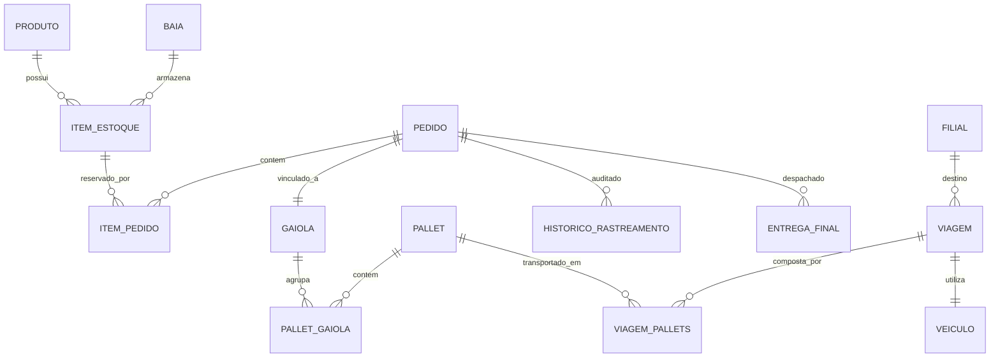

# 🚀 PetTrack WMS API

O **PetTrack** é um sistema backend robusto de gerenciamento de Centro de Distribuição (WMS), especializado no segmento pet e veterinário. O sistema orquestra todo o ciclo de vida logístico, desde a entrada física de fornecedores até a entrega final na última milha (last-mile).

> **Status**: Versão 1.0.0 (Junho de 2026)
> **Stack**: Java 17, Spring Boot 4, PostgreSQL 15

---

## 🏗️ Arquitetura e Engenharia
O projeto foi desenvolvido como um **Monolito Modular**, onde pacotes são organizados por módulos de negócio com fronteiras bem definidas. Esta arquitetura permite o desenvolvimento e debugging simplificado, mantendo transações ACID nativas e um caminho claro para uma futura extração para microsserviços.

### Pilares Técnicos
* **Logística Especializada**: Controle de cadeia fria (2$^{\circ}$C a 8$^{\circ}$C), FIFO automático por validade, rastreabilidade de lote Anvisa e controle de peso/capacidade.
* **Segurança**: Autenticação stateless via **JWT** (JSON Web Token), integrando Spring Security e criptografia de senhas via BCrypt.
* **Persistência**: Versionamento de banco de dados com **Flyway**, garantindo que todas as alterações estruturais sejam auditáveis e reprodutíveis.
* **Qualidade**: Cobertura de testes de integração com **Testcontainers**, validando o sistema contra instâncias reais do PostgreSQL.

---

## 📊 Modelo de Dados (ERD)



---

## 📋 Funcionalidades por Domínio Operacional

* **Gestão de Produtos**: Catálogo completo contendo espécie animal alvo, tipo de armazenamento exigido, peso, dimensões e controle de flag para regulação Anvisa.
* **Estoque**: Controle de baias físicas com capacidade limitada (em kg e unidades) e atualização dinâmica de status, aplicando ordenação FIFO por data de validade na separação.
* **Scheduler de Vencimentos**: Rotina agendada via ```@Scheduled``` que executa diariamente à meia-noite para atualizar produtos vencidos e gerar alertas preditivos de vencimento para os próximos 30 dias.
* **Recebimento**: Criação de ordens de descarga, fluxo de conferência física item a item com registro detalhado de divergências e destinação automatizada para as baias corretas.
* **E-commerce**: Triagem automatizada de pedidos mapeando a UF do cliente para uma das 6 macrorregiões do CD através de *switch expressions* do Java.
* **Transporte**: Paletização inteligente respeitando o peso máximo suportado, vinculação de gaiolas regionais e controle rigoroso de status de viagens.
* **Transportadores & Frotas**: Cadastro de parceiros logísticos próprios ou terceirizados com gerenciamento em tempo real da disponibilidade e capacidade de veículos.
* **Filiais & Last-Mile**: Processamento de pallets recebidos nas filiais, desmembramento por 31 subregiões específicas e despacho por vans com confirmação de recebimento ou registro de falhas.
* **Rastreamento**: Histórico imutável acionado por uma máquina de estados que audita e registra cada transição de status de todos os pedidos.
* **Cancelamento**: Regras de negócio restritivas baseadas no momento logístico do item; cancelamentos pós-transporte ativam fluxo de retorno físico ao CD, enquanto cancelamentos com vans já em rota são estritamente bloqueados.

---

## 🚀 Como Executar
### Pré-Requisitos
* **JDK 17 ou superior**
* **Docker e Docker Compose instalados**

### Passos para Execução:
1) **Clonar o repositório:**
```bash
git clone [https://github.com/henriquedarocha/pettrack.git](https://github.com/henriquedarocha/pettrack.git)
```

2) **Subir a Infraestrutura Local:**

    O arquivo ```docker-compose.yml``` já está configurado com PostgreSQL 15 e pgAdmin. Suba os containers utilizando:

```bash
docker-compose up -d
```

3) **Executar a Aplicação:**

    Utilize o Maven Wrapper incluso na raíz do projeto para inicializar o ecossistema Spring Boot:

```bash
./mvnw spring-boot:run
```

4) **Acessar a Documentação Interativa:**

    Com a aplicação rodando, toda a superfície de endpoints exposta e seus respectivos payloads podem ser visualizados e testados via Swagger UI através do endereço:
   http://localhost:8080/swagger-ui.html

---

## 🧪 Qualidade de Software e Testes

O projeto conta com testes de integração abrangentes cobrindo os fluxos mais críticos de serviços como ProdutoService, EstoqueService e AuthService. Para disparar a execução dos testes utilizando as instâncias reais criadas pelo Testcontainers, execute:

```bash
./mvnw test
```

---

## 📂 Estrutura de Módulos

```Plaintext
modules/
├── produto/        # Catálogo, categorias pet e regras Anvisa
├── usuario/        # Autenticação, perfis e controle de acessos
├── estoque/        # Gerenciamento de baias, itens e scheduler de validade
├── recebimento/    # Ordens de entrada e fluxo de conferência de notas fiscais
├── ecommerce/      # Pedidos, gaiolas e inteligência de roteamento regional
├── transporte/     # Consolidação de pallets e controle de viagens
├── transportadora/ # Gestão de frotas de veículos e restrições de peso
├── filial/         # Controle das unidades regionais de recebimento
├── rastreamento/   # Motor de persistência de histórico imutável de auditoria
├── entrega/        # Despacho de vans e rotinas de entrega de última milha
└── cancelamento/   # Validador de regras de estorno e retorno de inventário
```

---

## 📝 Licença

**Este projeto foi desenvolvido com finalidades acadêmicas, técnicas e de demonstração de portfólio profissional de arquitetura de software.**

**Todos os direitos reservados.**